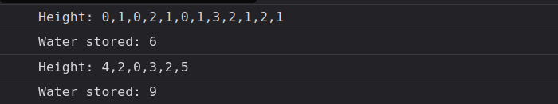

# Problem Statements

## Water Trap

We have to find the total water trapped in the entire elevation map. This can be divided into sums of water trapped in each column. Water trapped in each column has to be a function of the largest elevation on the left side and the largest elevation on the right side of the current column. Water that can be stored in a particular column start from that particular column's height and rise upto the minimum of height of columns in its prefix and suffix. We consider the smaller value out of prefix and suffix because any height greater than the smaller value will overflow and won't stay contained. 

For any i:
- Prefix[i] would store the max height of any column YET on the left side.
- Suffix[i] would store the max height of any column YET on the right side

Therefore ***water[i] = min(prefix[i], suffix[i]) - height[i];***

 

